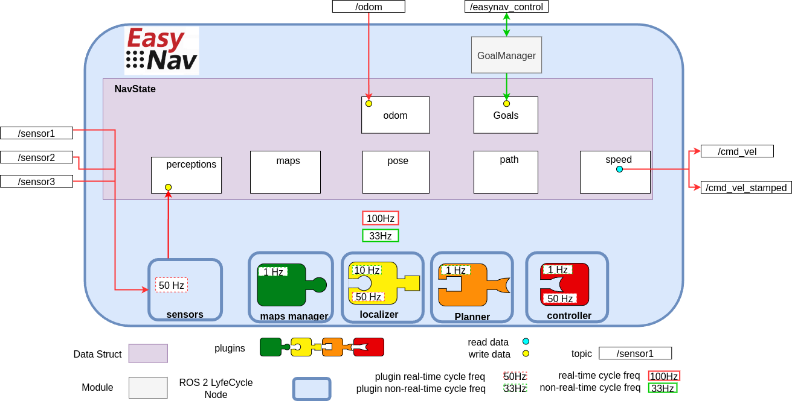
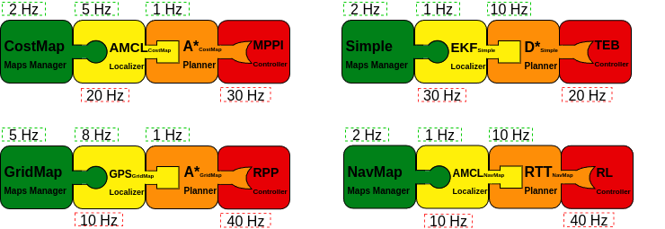
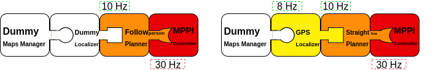

.. _design:

Core Design and Architecture
****************************

**EasyNav** is designed with three core principles in mind: modularity, real-time performance, and extensibility. Its architecture separates concerns into well-defined components, making it both easy to adapt and efficient to execute.

The figure above illustrates the general architecture of EasyNav.

EasyNav runs within a single process that hosts a ROS 2 **Lifecycle Node** called ``SystemNode``, which coordinates the entire navigation system. Through composition, ``SystemNode`` includes several other ROS 2 Lifecycle Nodes, each responsible for a specific function in the navigation pipeline:

- **Sensors Node**: This node collects and preprocesses all sensory input used by the navigation system, across six built-in perception types (point clouds/laser scans, images, IMU, GNSS, odometry, and 3D detections). Sensors are ungrouped by default; they are only placed into a named group when explicitly configured to do so (see :ref:`perceptions`).

- **MapsManager Node**: Responsible for how the environment is represented. It supports multiple plugins that define the actual data structure for the map: costmaps, NavMap triangulated meshes, Bonxai probabilistic voxel maps, octomaps, and simpler binary maps, among others. The plugin selection is configurable depending on the application or use case.

- **Localizer Node**: Estimates the robot's position within the map. It uses a localization plugin that must be compatible with the type of environment representation used by the MapsManager.

- **Planner Node**: Computes a path from the robot’s current position to its goal (as managed by the GoalManager). The selected plugin determines the planning algorithm used.

- **Controller Node**: Generates velocity commands to follow the planned path. Its functionality is encapsulated in a plugin, which outputs either ``Twist`` or ``TwistStamped`` messages depending on configuration.

An EasyNav application is built by combining multiple plugins from the different EasyNav components. Typical configurations may include combinations such as the following:

This figure illustrates several possible plugin compositions. The key aspect is ensuring that the selected plugins are compatible with one another. For example, if a maps manager based on costmaps is chosen, the remaining plugins must either support this representation or operate independently of it. In practice, the localizer and planner are usually tightly coupled to the representation defined by the maps manager, whereas the controller tends to be more independent, since it typically relies on route formats that are relatively standardized.

It is also possible to use *Dummy* plugins. Each component provides one in case you want to build an application that does not require that specific functionality. For example, a person-following application may not need either a map or a localizer, while an outdoor navigation application may rely on GPS for localization and simply plan a straight-line path to the target.

These plugin combinations are defined in the single EasyNav configuration file, where the plugins for each component and their execution frequencies are specified.

.. code-block:: yaml

   controller_node:
     ros__parameters:
       use_sim_time: true
       controller_types: [simple]
       simple:
         rt_freq: 30.0 
         plugin: easynav_simple_controller/SimpleController
         max_linear_speed: 0.6
         max_angular_speed: 1.0
         look_ahead_dist: 0.2
         k_rot: 0.5

   localizer_node:
     ros__parameters:
       use_sim_time: true
       localizer_types: [simple]
       simple:
         rt_freq: 50.0
         freq: 5.0
         reseed_freq: 1.0
         plugin: easynav_simple_localizer/AMCLLocalizer
         num_particles: 100
         noise_translation: 0.05
         noise_rotation: 0.1
         noise_translation_to_rotation: 0.1
         initial_pose:
           x: 0.0
           y: 0.0
           yaw: 0.0
           std_dev_xy: 0.1
           std_dev_yaw: 0.01

   maps_manager_node:
     ros__parameters:
       use_sim_time: true
       map_types: [simple]
       simple:
         freq: 10.0 
         plugin: easynav_simple_maps_manager/SimpleMapsManager
         package: easynav_indoor_testcase
         map_path_file: maps/home.map

   planner_node:
     ros__parameters:
       use_sim_time: true
       planner_types: [simple]
       simple:
         freq: 0.5
         plugin: easynav_simple_planner/SimplePlanner
         robot_radius: 0.3

   sensors_node:
     ros__parameters:
       use_sim_time: true
       forget_time: 0.5
       sensors: [laser1]
       laser1:
         topic: /scan_raw
         type: sensor_msgs/msg/LaserScan

   system_node:
     ros__parameters:
       use_sim_time: true
       position_tolerance: 0.1
       angle_tolerance: 0.05
  
Each node declares one or more plugin types (e.g., `simple`) that can be dynamically selected. The plugin name (e.g., `easynav_simple_controller/SimpleController`) must match the name registered in the plugin system.

This design allows for easy experimentation with different algorithms or system behaviors simply by modifying configuration files—without changing any source code.

Some applications may not require a full navigation pipeline. For example, systems focused on teleoperation, behavior testing, or hardware validation might not need environment representation, localization, or path planning.

To support such minimal setups, EasyNav provides a **Dummy plugin** for each core module. These plugins implement the required interfaces but do not perform any real computation. This allows the system to run with minimal overhead while remaining fully compatible with the rest of the EasyNav infrastructure.

Below is an example configuration using dummy plugins for all components, effectively creating a **Dummy Navigation System**:

.. code-block:: yaml

   controller_node:
     ros__parameters:
       use_sim_time: true
       controller_types: [dummy]
       dummy:
         rt_freq: 30.0
         plugin: easynav_controller/DummyController
         cycle_time_rt: 0.001

   localizer_node:
     ros__parameters:
       use_sim_time: true
       localizer_types: [dummy]
       dummy:
         rt_freq: 50.0
         freq: 5.0
         reseed_freq: 0.1
         plugin: easynav_localizer/DummyLocalizer
         cycle_time_nort: 0.01
         cycle_time_rt: 0.001

   maps_manager_node:
     ros__parameters:
       use_sim_time: true
       map_types: [dummy]
       dummy:
         freq: 10.0
         plugin: easynav_maps_manager/DummyMapsManager
         cycle_time_nort: 0.1

   planner_node:
     ros__parameters:
       use_sim_time: true
       planner_types: [dummy]
       dummy:
         freq: 1.0
         plugin: easynav_planner/DummyPlanner
         cycle_time_nort: 0.2

   sensors_node:
     ros__parameters:
       use_sim_time: true
       forget_time: 0.5

   system_node:
     ros__parameters:
       use_sim_time: true
       position_tolerance: 0.1
       angle_tolerance: 0.05

This configuration is especially useful for testing system integration, message flow, and user interfaces without requiring sensor data or a simulated robot. You can later replace dummy plugins with functional ones as needed.

Coordinate Frames (TF)
======================

EasyNav follows `REP-105 <http://www.ros.org/reps/rep-0105.html>`_ for its frame-naming
convention, and centralizes all frame configuration in a single place: ``system_node``. Rather
than each node or plugin declaring its own frame parameters (an early version of EasyNav had, for
example, a ``perception_default_frame`` parameter local to ``sensors_node``), ``SystemNode``
declares six frame parameters once, assembles them into a single ``TFInfo`` struct, and pushes it
into ``RTTFBuffer`` — a process-wide singleton that is *both* the shared ``tf2_ros::Buffer`` used
for real-time TF lookups *and* the single source of truth for frame names across EasyNav.

.. list-table::
   :header-rows: 1
   :widths: 25 20 55

   * - Parameter (on ``system_node``)
     - Default
     - Meaning
   * - ``tf_prefix``
     - ``""`` (empty)
     - Optional prefix prepended to every frame below; used to give each robot its own TF tree in
       multi-robot setups (see :doc:`../howtos/costmap_multirobot`).
   * - ``map_frame``
     - ``"map"``
     - Global map frame.
   * - ``odom_frame``
     - ``"odom"``
     - Odometry frame.
   * - ``robot_frame``
     - ``"base_link"``
     - Robot base frame.
   * - ``robot_footprint_frame``
     - ``"base_footprint"``
     - Robot footprint frame (e.g. used by ``SensorsNode`` as the target frame for the fused
       perception cloud, see :ref:`perceptions`).
   * - ``world_frame``
     - ``"earth"``
     - Global/earth-fixed frame used by global estimators (e.g. GNSS-based fusion in
       ``easynav_fusion_localizer``).

On ``on_configure()``, ``SystemNode`` reads these six parameters into a ``TFInfo`` and calls
``RTTFBuffer::getInstance()->set_tf_info(tf_info)``. If ``tf_prefix`` is non-empty, this call
automatically prepends ``"<tf_prefix>/"`` to ``map_frame``, ``odom_frame``, ``robot_frame``,
``robot_footprint_frame`` and ``world_frame`` — this is how a multi-robot setup gets a fully
namespaced TF tree per robot (``r1/base_link``, ``r1/odom``, ...) from a single ``tf_prefix: r1``
parameter, without spelling out every frame name per robot.

Any node or plugin that needs a frame name reads it from the shared singleton instead of
hardcoding a literal such as ``"map"`` or ``"base_link"``:

.. code-block:: cpp

   const auto & tf_info = easynav::RTTFBuffer::getInstance()->get_tf_info();
   const std::string & map_frame = tf_info.map_frame;

This is why plugins (obstacle filters, localizers, the fused-perception publisher in
``SensorsNode``, ...) always resolve frames through ``RTTFBuffer::getInstance()->get_tf_info()``
rather than through a per-node parameter.

NavState: The Shared Blackboard
===============================

A key architectural component of EasyNav is the **NavState**, a shared *blackboard* that holds all the internal state information required by the navigation system.

Each module in EasyNav—such as the Localizer, Planner, or Controller—reads its inputs from the NavState and writes its outputs back to it. This central structure replaces the need for internal ROS 2 communications between modules.

The motivation behind using a shared blackboard is to:

- **Avoid ROS 2 topic-based communication internally**, reducing unnecessary overhead and complexity.
- **Improve real-time determinism**, as data access becomes local and predictable.
- **Simplify integration and debugging**, by consolidating all system-relevant information in a single place.

The NavState contains data such as:

- the robot's estimated pose,
- the current navigation goal,
- planned paths,
- velocity commands,
- perception data,
- and diagnostic or meta-state information.

By inspecting the NavState at runtime, developers gain full visibility into the internal state of EasyNav at any given moment. This approach not only improves transparency, but also enables advanced tooling for monitoring, introspection, and explainability.

Future versions of EasyNav may include graphical or CLI-based tools to explore and trace the NavState over time.

Real-Time Execution Model
=========================

Another key feature of EasyNav is its emphasis on **real-time performance**. The navigation system is designed to react with strict timing constraints, minimizing latency from perception to action.

To achieve this, EasyNav separates execution into two distinct control loops:

- **Real-Time Cycle**  
  This loop is optimized for minimal end-to-end latency. Its goal is to process new sensor data and update the robot’s motion commands as quickly as possible. It includes:
  
  - perception input processing,
  - pose prediction via odometry,
  - and velocity command generation (e.g., ``Twist`` or ``TwistStamped``).

- **Non-Real-Time Cycle**  
  This loop handles operations where occasional execution delays are tolerable. Tasks in this loop include:
  
  - map updates,
  - localization corrections based on perception (e.g., particle filter resampling),
  - and path planning.

Each EasyNav module is configured with a frequency for both real-time and non-real-time cycles. These are specified in the parameters as `rt_freq` and `freq`, respectively.

Additionally, when new perception data is received, the real-time cycle is **triggered immediately**, allowing the system to respond as fast as possible and minimize perception-to-action latency.

This dual-cycle model balances **responsiveness** with **computational stability**, ensuring critical actions happen with deterministic timing while less urgent tasks are scheduled opportunistically.

