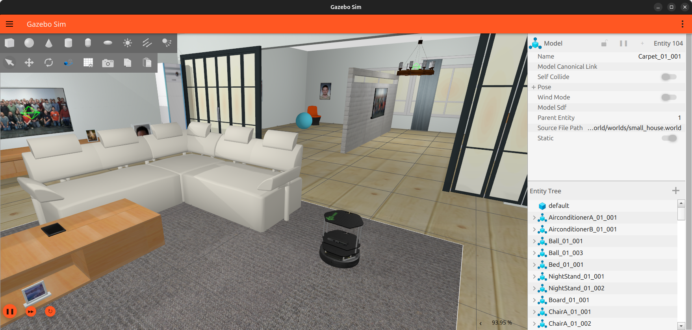
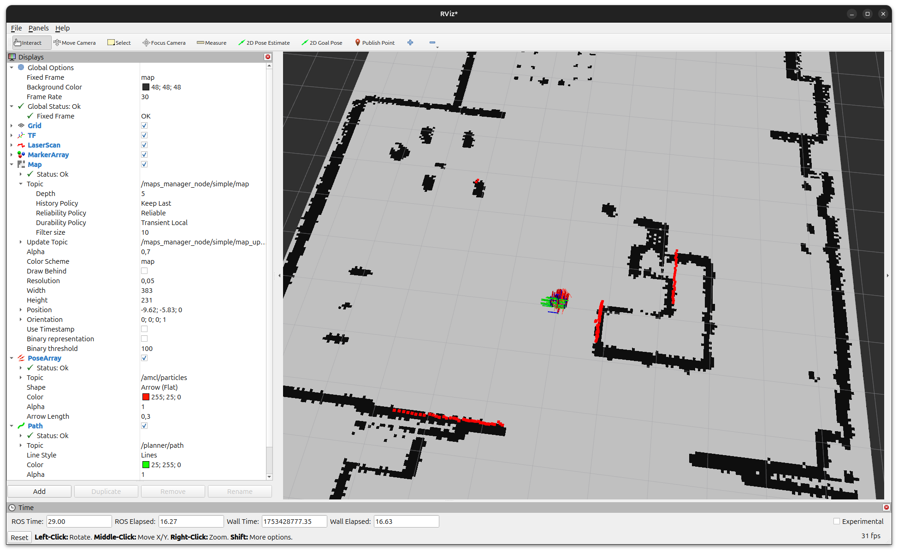
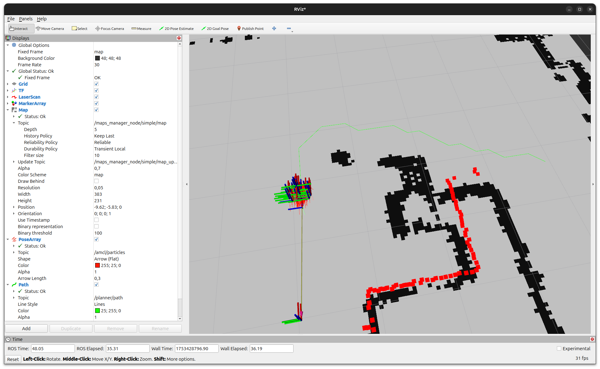
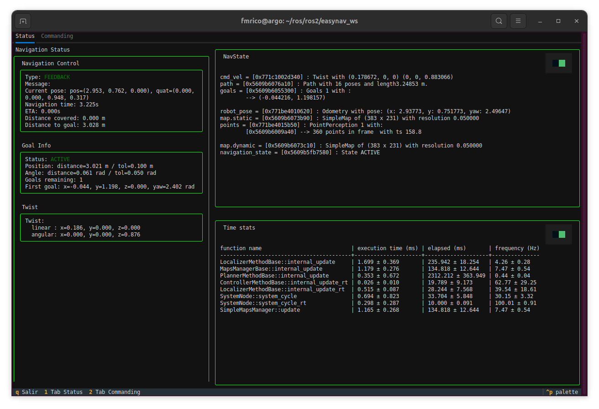

.. _getting_started:

================
Getting Started
================

This section guides you through your **first run of EasyNavigation (EasyNav)** using a simulated Turtlebot2 robot in a domestic environment.

If you have not yet installed EasyNav, please complete the steps in :doc:`../build_install/index`.

.. contents:: On this page
   :local:
   :depth: 2

Overview
--------

We will run a ready-to-use simulation setup consisting of:

- **Robot:** Turtlebot2 (Kobuki)
- **Environment:** indoor domestic map
- **Stack:** *Simple Stack* included within `easynav_plugins`
- **Simulator:** Gazebo Harmonic with RViz2 visualization

Workspace layout
----------------

This guide builds two extra packages on top of your EasyNav installation:
``easynav_playground_kobuki`` (the Gazebo simulation) and ``easynav_indoor_testcase``
(maps, parameter files and RViz configurations). These are example/demo content and
are only distributed as source, so you need a small colcon workspace at
``~/easynav_ws`` regardless of which method you used to install EasyNav's core
packages in :doc:`../build_install/index`:

- Installed via :ref:`install_apt`: create the workspace now.

  .. code-block:: bash

     mkdir -p ~/easynav_ws/src

- Installed via :ref:`install_pixi`: reuse the workspace where you saved your
  ``pixi.toml`` (``~/easynav_ws``), and add the build tools needed to compile source
  packages inside the Pixi environment.

  .. code-block:: bash

     cd ~/easynav_ws
     pixi add colcon-common-extensions compilers cmake make ninja pkg-config rosdep
     mkdir -p src

- Installed via :ref:`build_from_source`: you already have this workspace, with
  ``EasyNavigation``, ``NavMap``, ``easynav_plugins`` and ``yaets`` cloned under
  ``src/``.

Clone the demo repositories into ``~/easynav_ws/src`` and install their dependencies:

.. code-block:: bash

   cd ~/easynav_ws/src
   git clone https://github.com/EasyNavigation/easynav_playground_kobuki.git
   git clone https://github.com/EasyNavigation/easynav_indoor_testcase.git
   # Clone third-party dependencies using vcs tool
   vcs import . < easynav_playground_kobuki/thirdparty.repos
   # Install dependencies via rosdep
   cd ~/easynav_ws
   rosdep install --from-paths src --ignore-src -y -r

.. _gs_source_workspace:

Build and source the workspace
~~~~~~~~~~~~~~~~~~~~~~~~~~~~~~~

.. code-block:: bash

   cd ~/easynav_ws
   colcon build --symlink-install

Then source the environment, depending on how you installed EasyNav:

- **APT** or **build from source**:

  .. code-block:: bash

     source /opt/ros/<distro>/setup.bash
     source ~/easynav_ws/install/setup.bash

- **Pixi** (run inside ``pixi shell``, or prefix commands with ``pixi run``):

  .. code-block:: bash

     source ~/easynav_ws/install/setup.bash

You will need to repeat this sourcing step in every new terminal you open for the
rest of this guide.

Repository overview
-------------------

- **easynav_playground_kobuki** --> Gazebo simulation for the Turtlebot2 (Kobuki).
- **easynav_indoor_testcase** --> provides maps, parameter files, and RViz configurations for indoor navigation.

Simulation setup
----------------

Once your workspace is built and sourced, launch the Gazebo simulation:

.. code-block:: bash

   cd ~/easynav_ws
   ros2 launch easynav_playground_kobuki playground_kobuki.launch.py

This starts a Gazebo Harmonic simulation of a Turtlebot2 robot in a domestic environment.

To save resources, you can disable the Gazebo graphical interface:

.. code-block:: bash

   ros2 launch easynav_playground_kobuki playground_kobuki.launch.py gui:=false

Launching EasyNav
-----------------

With the simulator running, open a **new terminal** and source your workspace again
as described in :ref:`gs_source_workspace`:

.. code-block:: bash

   cd ~/easynav_ws

Now start the EasyNav system using the predefined parameter file:

.. code-block:: bash

   ros2 run easynav_system system_main \
      --ros-args --params-file src/easynav_indoor_testcase/robots_params/simple.params.yaml

This command launches the EasyNav core using the *Simple Stack* configuration located in `easynav_plugins`.

Visualizing in RViz2
--------------------

Open another new terminal and start RViz2 with the provided configuration:

.. code-block:: bash

   # Note: First, source the environment as shown previously.
   ros2 run rviz2 rviz2 \
      -d ~/easynav_ws/src/easynav_indoor_testcase/rviz/simple.rviz \
      --ros-args -p use_sim_time:=true

.. note::

   In RViz2, ensure the **QoS** of the ``/map`` topic is set to **Transient Local**  
   so that the map is properly displayed when EasyNav publishes it.

Sending navigation goals
------------------------

Once RViz2 is open, use the **"2D Goal Pose"** tool (in the top toolbar)  
to send a navigation goal. Click on a point in the map, and the robot will start navigating.

.. note::

   The Simple stack contains very basic algorithms, like A* and PID-based controller. It is expected that
   navigation won't be optimal.

Visualizing internal process with the TUI
-----------------------------------------

In addition to RViz2, **EasyNav** provides a **Terminal User Interface (TUI)** that allows you to monitor
the internal state of the navigation system in real time.  
It is a text-based dashboard that displays key diagnostic information and performance metrics directly in the terminal.

You can launch it in a new terminal after starting the EasyNav system:

.. code-block:: bash

   ros2 run easynav_tools tui

The TUI is divided into several panels:

- **Navigation Control:** shows the current navigation mode (e.g., FEEDBACK, ACTIVE), current robot pose, progress toward the goal, and remaining distance.
- **Goal Info:** displays details of the active navigation goal, angular and positional tolerances, and goal list.
- **Twist:** real-time linear and angular velocity commands issued by the controller.
- **NavState:** shows internal blackboard data structures such as `robot_pose`, `cmd_vel`, active `map`, and `navigation_state`.
- **Time stats:** performance profiling of each system component (localizer, planner, controller, maps manager, etc.) including average execution time and update frequency.

This interface is especially useful for debugging or performance evaluation without relying on graphical tools.

Press **q** to exit the TUI.

.. note::

   The TUI is optimized for dark terminals and supports color highlighting for active modules and
   real-time performance indicators.

Troubleshooting
---------------

- **Robot does not move:** ensure that both Gazebo and EasyNav terminals are running and synchronized with the same simulation time (`use_sim_time:=true`).
- **Map not visible in RViz2:** check the QoS setting and verify the `/map` topic is being published.
- **Build errors:** revisit :doc:`../build_install/index` and ensure dependencies were correctly installed via `rosdep`.

Next steps
----------

You have successfully launched **EasyNav** with a simulated robot!

Continue exploring:

- :doc:`../howtos/index` — follow practical guides for mapping, navigation, and real robot deployment.  
- :doc:`../developer_guide/index` — dive into the internal design and architecture of the EasyNav framework.

.. toctree::
   :hidden:
