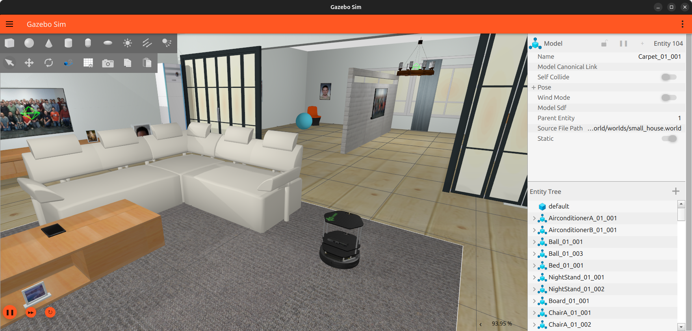
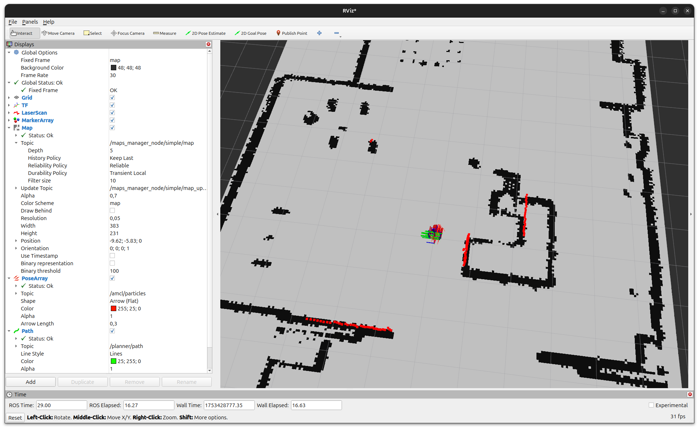
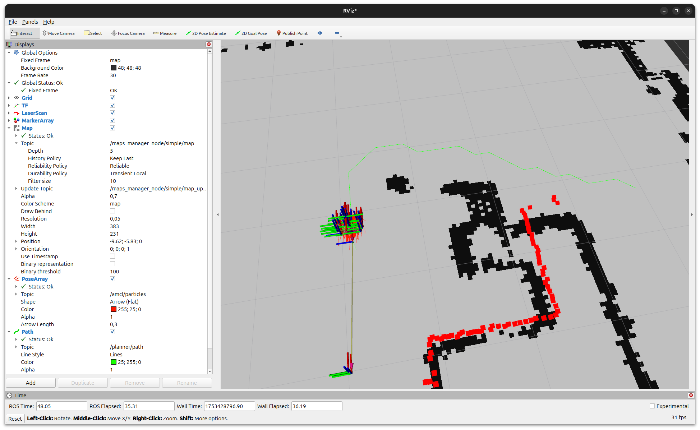
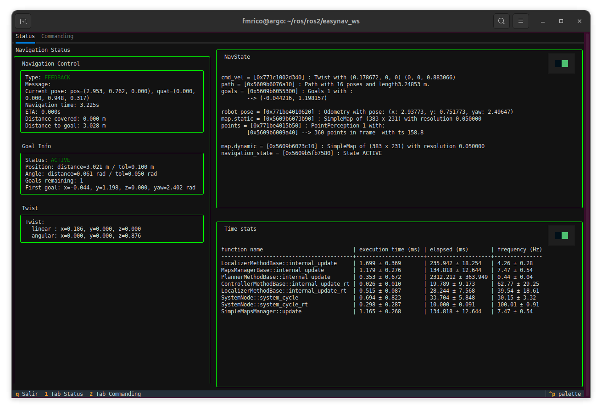

.. _getting_started:

================
Getting Started
================

This section guides you through your **first run of EasyNavigation (EasyNav)** using a simulated
Turtlebot2 robot in a domestic environment, from the :doc:`Kobuki PlayGround
<../playgrounds/kobuki>`.

.. contents:: On this page
   :local:
   :depth: 2

Overview
--------

We will run a ready-to-use simulation setup consisting of:

- **Robot:** Turtlebot2 (Kobuki) with a 2D lidar
- **Environment:** indoor domestic map (AWS RoboMaker small house)
- **Configuration:** first the *Simple* plugins, then the *Costmap* plugins with the Regulated
  Pure Pursuit controller
- **Simulator:** Gazebo Harmonic with RViz2 visualization

Setting up the workspace
------------------------

Build EasyNav from source as described in :ref:`build_from_source` (``~/easynav_ws``).

Then clone the Kobuki PlayGround into the same workspace, install its dependencies and build it:

.. code-block:: bash

   cd ~/easynav_ws/src
   git clone -b rolling https://github.com/EasyNavigation/easynav_playgrounds.git
   cd ~/easynav_ws
   rosdep install --from-paths src --ignore-src -y -r
   colcon build --symlink-install --cmake-args -DCMAKE_BUILD_TYPE=Release

The PlayGround is self-contained: the robot model, the world, the maps and the EasyNav
configurations are all in this package.

.. _gs_source_workspace:

Sourcing the workspace
~~~~~~~~~~~~~~~~~~~~~~

In every new terminal you open for the rest of this guide:

.. code-block:: bash

   source /opt/ros/<distro>/setup.bash
   source ~/easynav_ws/install/setup.bash

First run: the Simple stack
---------------------------

Launching the simulator
~~~~~~~~~~~~~~~~~~~~~~~

In a first terminal, start the simulation of a Turtlebot2 robot in a domestic environment:

.. code-block:: bash

   ros2 launch easynav_playground_kobuki_worlds gazebo_sim.launch.yaml

To save resources, you can disable the Gazebo graphical interface with ``gui:=false``.

Launching EasyNav
~~~~~~~~~~~~~~~~~

EasyNav is **a single program**, ``system_main``, and **a parameter file** that says which
plugins it uses and how. In a second terminal, start it with the PlayGround's
``params/simple.params.yaml``:

.. code-block:: bash

   ros2 run easynav_system system_main --ros-args \
     --params-file $(ros2 pkg prefix easynav_playground_kobuki)/share/easynav_playground_kobuki/params/simple.params.yaml

The parameter file configures the *Simple* plugins: a binary occupancy map (``maps/home.map``),
an AMCL localizer over it, an A* planner and a proportional controller.

.. warning::
   The Simple stack is a **minimal example**, with very basic algorithms, made to show how EasyNav
   works and how plugins are written. Do not expect good navigation from it. For real use, try the
   Costmap configuration below.

Visualizing in RViz2
~~~~~~~~~~~~~~~~~~~~

In a third terminal, start RViz2 with the PlayGround's configuration:

.. code-block:: bash

   ros2 run rviz2 rviz2 \
     -d $(ros2 pkg prefix easynav_playground_kobuki)/share/easynav_playground_kobuki/rviz/easynav_simple.rviz \
     --ros-args -p use_sim_time:=true

Sending navigation goals
~~~~~~~~~~~~~~~~~~~~~~~~

In RViz2, use the **"2D Goal Pose"** tool (in the top toolbar) to send a navigation goal. Click on
a point in the map, and the robot will start navigating.

Navigating with the Costmap stack
---------------------------------

Stop EasyNav (**Ctrl+C** in its terminal) and start it again with another parameter file, the
recommended indoor configuration: a costmap with obstacles and inflation, AMCL, A* and the
Regulated Pure Pursuit controller. Same program, different parameters:

.. code-block:: bash

   ros2 run easynav_system system_main --ros-args \
     --params-file $(ros2 pkg prefix easynav_playground_kobuki)/share/easynav_playground_kobuki/params/costmap.rpp.params.yaml

In RViz2, open the costmap view (*File > Open Config*,
``share/easynav_playground_kobuki/rviz/easynav_costmap.rviz``, or restart RViz2 with it), and send
goals as before.

This configuration also runs the recovery system (see :ref:`recovery`): a collision safety reflex
that brakes before a collision, and recoveries for an obstacle too close, a robot that does not
progress, a lost localization, or no path to the goal.

All in one launch file
~~~~~~~~~~~~~~~~~~~~~~

The PlayGround also has launch files that start the three things at once. For the configuration
above:

.. code-block:: bash

   ros2 launch easynav_playground_kobuki easynav_costmap_rpp.launch.yaml

The :doc:`Kobuki PlayGround <../playgrounds/kobuki>` page lists the other configurations (MPPI,
MPC, SeReST, MH-AMCL, routes, safety mode, multirobot), and what each launch file starts.

Visualizing internal process with the TUI
-----------------------------------------

In addition to RViz2, **EasyNav** provides a **Terminal User Interface (TUI)** that allows you to monitor
the internal state of the navigation system in real time.
It is a text-based dashboard that displays key diagnostic information and performance metrics directly in the terminal.

You can launch it in a new terminal after starting the EasyNav system:

.. code-block:: bash

   ros2 run easynav_tools tui

The TUI is divided into several panels:

- **Navigation Control:** shows the current navigation mode (e.g., FEEDBACK, ACTIVE), current robot pose, progress toward the goal, and remaining distance.
- **Goal Info:** displays details of the active navigation goal, angular and positional tolerances, and goal list.
- **Twist:** real-time linear and angular velocity commands published by EasyNav.
- **Diagnostics:** the diagnostics of the recovery system (``diagnostic_msgs/DiagnosticArray`` on ``diagnostics``), e.g. from ``DiagnosticRecoveryManager`` (see :ref:`recovery`).
- **Mitigation:** what the active recovery mitigation reports doing (on ``mitigation``), cleared when the problem is resolved.
- **NavState:** shows internal blackboard data structures such as `robot_pose`, `cmd_vel`, active `map`, and `navigation_state`.
- **Time stats:** performance profiling of each system component (localizer, planner, controller, maps manager, etc.) including average execution time and update frequency.

This interface is especially useful for debugging or performance evaluation without relying on graphical tools.

Press **q** to exit the TUI.

.. note::

   The TUI is optimized for dark terminals and supports color highlighting for active modules and
   real-time performance indicators.

Troubleshooting
---------------

- **Robot does not move:** check that EasyNav is running (``system_main`` in its terminal) and
  that the localization in RViz2 matches the robot's position in Gazebo.
- **EasyNav terminates by itself:** the recovery system may have requested a shutdown (e.g. no
  sensor data, or a miswired ROS graph). The reason is printed when ``system_main`` exits.
- **The robot does not appear in Gazebo:** if you switched branches of the PlayGround, remove its
  ``build/`` and ``install/`` directories and build it again: with ``--symlink-install``, files
  removed in the new branch stay in ``install/`` as broken links.
- **Build errors:** revisit :doc:`../build_install/index` and ensure dependencies were correctly
  installed via ``rosdep``.

Next steps
----------

You have successfully launched **EasyNav** with a simulated robot!

Continue exploring:

- :doc:`../playgrounds/index` — the other robots and configurations.
- :doc:`../howtos/index` — follow practical guides for mapping, navigation, and real robot deployment.
- :doc:`../developer_guide/index` — dive into the internal design and architecture of the EasyNav framework.
- :doc:`../migration_guide/index` — if your robot already uses Nav2, how to try EasyNav on it.

.. toctree::
   :hidden:
