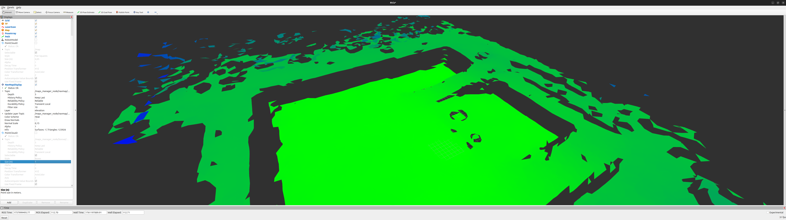

.. _bonxai_navmap_from_rosbag:

======================================================
Building Bonxai and NavMap Maps from a Recorded ROSBag
======================================================

This HowTo shows how to generate both **Bonxai** and **NavMap** representations
from a **recorded ROSBag** containing a ``PointCloud2`` map, typically produced
by a SLAM algorithm. The input point cloud must be referenced to the ``world``
or ``map`` frame.

.. contents:: On this page
   :local:
   :depth: 2

---

Setup
-----

Install EasyNav (see :doc:`../build_install/index`) with the two plugins this tutorial uses, the
**Bonxai Maps Manager** and the **NavMap Maps Manager**:

.. code-block:: bash

   sudo apt install ros-<distro>-easynav ros-<distro>-easynav-bonxai-maps-manager \
     ros-<distro>-easynav-navmap-maps-manager

You also need a recorded ROS bag containing a ``PointCloud2`` map, e.g. recorded while running a
3D lidar SLAM. The commands below use a bag of the URJC excavation; use your own.

---

Overview
--------

You will:

1. Align coordinate frames (``world`` → ``map`` if needed).  
2. Play a pre-recorded ROS bag containing the ``/map`` point cloud.  
3. Launch EasyNav with both **BonxaiMapsManager** and **NavMapMapsManager**
   to build the two maps simultaneously.  
4. Visualize both in **RViz2**.  
5. Save the resulting maps to disk.

---

1. Align the Frames (world → map)
---------------------------------

If your ROS bag publishes a ``PointCloud2`` in the frame ``world``,
you need to publish a static transform so that the **map managers**
receive data in ``map``.

In a new terminal, run:

.. code-block:: bash

   ros2 run tf2_ros static_transform_publisher --frame-id world --child-frame-id map

Keep this terminal **running for the entire session**.  
If your point cloud is already in the ``map`` frame, skip this step.

---

2. Play the ROSBag
------------------

Next, replay the recorded ROS bag containing the point cloud map.

The example bag is about 1600 seconds long.  
To jump close to the end (around 1500 seconds, when the map is already dense)
but still leave a few seconds to build the maps, run:

.. code-block:: bash

   ros2 bag play rosbag_excavation_urjc_map_tf_only --clock --start-offset 1500

This will replay the point cloud topic ``/map`` and the TF tree
needed by the map managers.

---

3. Launch EasyNav with Bonxai and NavMap Maps Managers
------------------------------------------------------

In a new terminal, launch **EasyNav System** with both map managers active.

.. code-block:: bash

   ros2 run easynav_system system_main \
     --ros-args \
     --params-file /absolute/path/to/bonxai-navmap.dummy.params.yaml \
     -r /maps_manager_node/navmap/incoming_pc2_map:=/map \
     -r /maps_manager_node/bonxai/incoming_pc2_map:=/map

This setup assumes:

- The input cloud topic is ``/map``.  
- The QoS settings are standard (reliable, transient local).  
- Both managers will build their respective maps automatically.

The file ``bonxai-navmap.dummy.params.yaml`` defines **dummy plugins**
for all nodes except ``maps_manager_node``. The maps managers have no map file (``package`` and
``bonxai_path_file`` / ``navmap_path_file``), so they start empty and build their maps from the
incoming cloud.

Example configuration:

.. code-block:: yaml

    controller_node:
      ros__parameters:
        use_sim_time: true
        controller_types: [dummy]
        dummy:
          rt_freq: 30.0 
          plugin: easynav_controller/DummyController
          cycle_time_nort: 0.01
          cycle_time_rt: 0.001

    localizer_node:
      ros__parameters:
        use_sim_time: true
        localizer_types: [dummy]
        dummy:
          rt_freq: 50.0
          freq: 5.0
          reseed_freq: 0.1
          plugin: easynav_localizer/DummyLocalizer
          cycle_time_nort: 0.01
          cycle_time_rt: 0.001

    maps_manager_node:
      ros__parameters:
        use_sim_time: true
        map_types: [bonxai, navmap]
        bonxai:
          freq: 10.0
          plugin: easynav_bonxai_maps_manager/BonxaiMapsManager
        navmap:
          freq: 10.0
          plugin: easynav_navmap_maps_manager/NavMapMapsManager

    planner_node:
      ros__parameters:
        use_sim_time: true
        planner_types: [dummy]
        dummy:
          freq: 1.0
          plugin: easynav_planner/DummyPlanner
          cycle_time_nort: 0.2
          cycle_time_rt: 0.001

    sensors_node:
      ros__parameters:
        use_sim_time: true
        forget_time: 0.5

    system_node:
      ros__parameters:
        use_sim_time: true
        use_real_time: false
        position_tolerance: 0.3
        angle_tolerance: 0.15

---

4. NavMap Build Parameters
--------------------------

Internally, when the **NavMapMapsManager** builds a mesh from an incoming ``PointCloud2``
(``incoming_pc2_map``), it calls ``navmap_ros::from_pointcloud2()`` with a
``navmap_ros::BuildParams`` structure that controls mesh reconstruction quality:

**Available parameters (current defaults, not yet exposed as ROS parameters)**

+----------------------+----------------------------------------------------------+---------+
| **Parameter**        | **Description**                                          | Default |
+======================+==========================================================+=========+
| ``resolution``       | In-plane sampling resolution (m) for voxelization.       | 1.0     |
+----------------------+----------------------------------------------------------+---------+
| ``max_edge_len``     | Maximum triangle edge length (m).                        | 2.0     |
+----------------------+----------------------------------------------------------+---------+
| ``max_dz``           | Maximum allowed vertical jump (m) between vertices.      | 0.25    |
+----------------------+----------------------------------------------------------+---------+
| ``max_slope_deg``    | Maximum slope (degrees) relative to the vertical axis.   | 30.0    |
+----------------------+----------------------------------------------------------+---------+
| ``neighbor_radius``  | Neighborhood radius (m) for triangle connectivity.       | 2.0     |
+----------------------+----------------------------------------------------------+---------+
| ``k_neighbors``      | Alternative to radius: number of nearest neighbors.      | 20      |
+----------------------+----------------------------------------------------------+---------+
| ``min_area``         | Minimum triangle area (m²) to reject degenerate faces.   | 1e-6    |
+----------------------+----------------------------------------------------------+---------+
| ``use_radius``       | Use radius-based vs. k-NN connectivity. (bool)           | true    |
+----------------------+----------------------------------------------------------+---------+
| ``min_angle_deg``    | Minimum interior angle (degrees) to avoid slivers.       | 20.0    |
+----------------------+----------------------------------------------------------+---------+
| ``max_surfaces``     | Keep only the N largest connected surfaces (0 = all).    | 0       |
+----------------------+----------------------------------------------------------+---------+

.. note::

   These fields are defined by ``navmap_ros::BuildParams`` (see ``navmap_ros/conversions.hpp`` in
   the `NavMap <https://github.com/EasyNavigation/NavMap>`_ repository), but as of this writing the
   ``NavMapMapsManager`` constructs this structure with its default values when handling
   ``incoming_pc2_map`` — it does **not** currently read them from the ``navmap`` plugin's YAML
   configuration. If you need different mesh-reconstruction quality, you must change these defaults
   in code (or check whether a newer release of ``easynav_navmap_maps_manager`` has since exposed
   them as ROS parameters).

---

5. Visualize in RViz2
---------------------

Open **RViz2** to monitor both map managers.

.. code-block:: bash

   ros2 run rviz2 rviz2 --ros-args -p use_sim_time:=true

In RViz:

- Add a **PointCloud2** display for **Bonxai** maps.
  - Select the topic published by BonxaiMapsManager (e.g., ``/maps_manager_node/bonxai/map``).  
  - QoS: **Transient Local**.  
  - You can visualize the cloud as boxes with configurable size for clearer 3D structure.

- Add a **NavMapDisplay** (custom display type).
  - Select the topic published by NavMapMapsManager (e.g., ``/maps_manager_node/navmap/map``).  
  - QoS: **Transient Local**.

.. figure:: ../images/mapping_tut_bonxai.png
   :align: center
   :width: 70%

   Bonxai map visualization in RViz.

   NavMap mesh visualization in RViz.

---

6. Save the Maps
----------------

When both maps are visible and complete, you can store them to disk using
their respective map manager services.

**Save NavMap**

.. code-block:: bash

   ros2 service call /maps_manager_node/navmap/savemap std_srvs/srv/Trigger

The ``NavMapMapsManager`` always writes to the hardcoded path ``/tmp/map.navmap``
(this is unconditional in the current implementation, regardless of any ``navmap_path_file``
you configured). Rename and move it to your desired location (e.g. inside ``maps/``).

**Save Bonxai Map**

.. code-block:: bash

   ros2 service call /maps_manager_node/bonxai/savemap std_srvs/srv/Trigger

Unlike the NavMap manager, ``BonxaiMapsManager`` saves back to the path it loaded the map from
(``package``/``bonxai_path_file``): with no map file configured, as here, to
``/tmp/bonxai_map.pcd``. Move both files into the ``maps/`` directory of a package, and load them
with ``package`` and ``bonxai_path_file`` / ``navmap_path_file`` (see :doc:`navmap_navigating`).

---

7. Summary
----------

You have:

- ✅ Aligned frames between ``world`` and ``map``
- ✅ Played a recorded ROS bag with point cloud data  
- ✅ Built Bonxai and NavMap maps simultaneously  
- ✅ Visualized them in RViz  
- ✅ Saved both maps to disk for future use

These maps can now be used in a NavMap + Bonxai navigation stack (see
:doc:`navmap_navigating`).

---

**Next steps:**

- :doc:`../developer_guide/design`
- :doc:`navmap_navigating`
