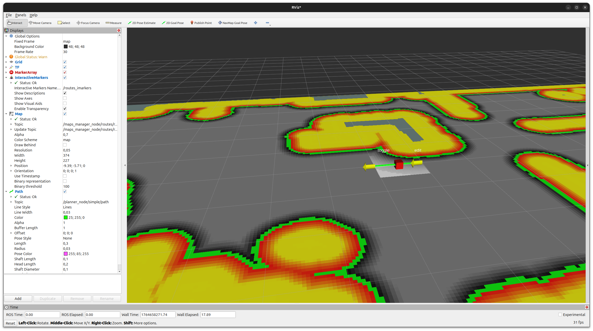
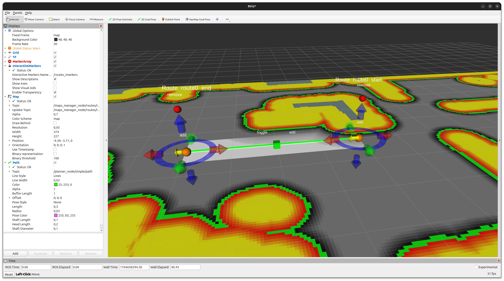
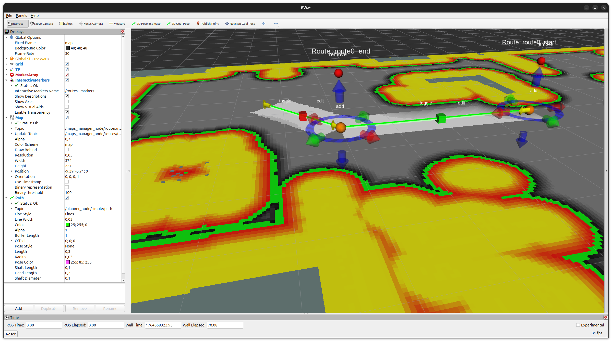
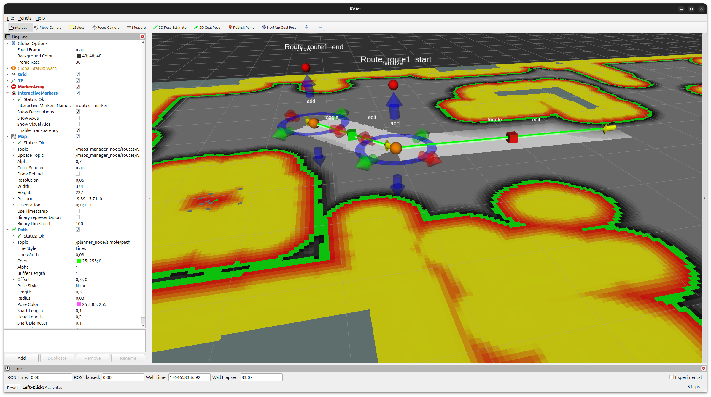

.. _howto_routes_costmap_manager:

Using the Routes Maps Manager with Costmaps
===========================================

This how-to describes how to create and use navigation routes with
:mod:`easynav_routes_maps_manager` and how to constrain a 2D costmap
around those routes using the :mod:`easynav_routes_maps_manager/RoutesCostmapFilter`
plugin.

The process is split in two main steps:

1. **Creating routes** interactively and saving them to a YAML file.
2. **Using the saved routes** in a full navigation stack so that the
   costmap is filtered to keep the robot close to the defined routes.

.. note::

   This how-to assumes that you already have an EasyNav workspace and a
   working costmap-based scenario (e.g., the indoor testcase). Only the
   parts specific to routes are shown here.

1) Creating routes
------------------

In this first step we will run only the maps manager node with a minimal
configuration: a costmap maps manager providing the 2D map, and a routes
maps manager with the routes costmap filter enabled. All other components
(controller, planner, localizer, etc.) can be left out or run with dummy
configurations, since we only care about editing and saving the routes.

Example parameters file
^^^^^^^^^^^^^^^^^^^^^^^

Below is an example of a minimal parameters file focused on costmap and
routes only:

.. code-block:: yaml

   maps_manager_node:
     ros__parameters:
       use_sim_time: false
       map_types: [costmap, routes]
       routes:
         freq: 10.0
         plugin: easynav_routes_maps_manager/RoutesMapsManager
         filters: [routes_costmap]
         routes_costmap:
           plugin: easynav_routes_maps_manager/RoutesCostmapFilter
           min_cost: 50
           route_width: 0.5
         cycle_time_nort: 0.001
         cycle_time_rt: 0.001
       costmap:
         freq: 10.0
         plugin: easynav_costmap_maps_manager/CostmapMapsManager
         package: easynav_indoor_testcase
         map_path_file: maps/home2.yaml
         filters: [obstacles, inflation]
         obstacles:
           plugin: easynav_costmap_maps_manager/CostmapMapsManager/ObstaclesFilter
         inflation:
           plugin: easynav_costmap_maps_manager/CostmapMapsManager/InflationFilter
           inflation_radius: 1.3
           inscribed_radius: 0.25
           cost_scaling_factor: 3.0

Key points:

- The ``costmap`` block is configured as in a normal EasyNav scenario and
  provides the 2D map on which the routes will be drawn.
- The ``routes`` block enables the :class:`easynav::RoutesMapsManager`
  plugin and the :class:`easynav::RoutesCostmapFilter` filter. In this
  phase we mainly care about seeing the effect of the routes corridor on
  the costmap while editing the routes.
- No ``package`` or ``map_path_file`` are provided under ``routes``. In
  this case the routes manager starts with a single default segment from
  ``(0, 0, 0)`` to ``(1, 0, 0)`` in the map frame.

Running the maps manager
^^^^^^^^^^^^^^^^^^^^^^^^

With the parameters file in place, start the maps manager node (for
example from a launch file or directly with ``ros2 run``), and open
RViz22.

You should see:

- The static and dynamic costmaps published by the costmap maps manager.
- A single straight route segment (line + arrow) corresponding to the
  default route.

Editing routes with interactive markers
^^^^^^^^^^^^^^^^^^^^^^^^^^^^^^^^^^^^^^^

The following sequence illustrates how to edit and extend routes using
the interactive markers published by the routes maps manager.

Step 0 – initial default segment
~~~~~~~~~~~~~~~~~~~~~~~~~~~~~~~~

   RViz2 just after starting the maps manager with no routes file:
   a single default segment from ``(0, 0, 0)`` to ``(1, 0, 0)`` is shown.

When the routes maps manager starts without a configured routes file, it
creates a single default segment in the map frame. In RViz2 you should
see this straight segment (line + arrow) over the costmap.

Step 1 – enabling the edit markers
~~~~~~~~~~~~~~~~~~~~~~~~~~~~~~~~~~

.. figure:: ../images/routes_costmap_howto_step_1.png
   :align: center
   :width: 80%

   Clicking the green box enables the interactive markers for that segment.

The routes manager publishes interactive markers for editing the start
and end points of each segment and for adding/removing segments. In RViz2,
add an "Interactive Markers" display and select the server corresponding
to ``routes`` (typically ``routes_imarkers`` or similar, depending on
your namespace).

Click the **green box** associated with the segment to toggle edit mode
on. When edit mode is enabled, RViz2 displays interactive markers on the
segment endpoints:

- **Move arrows** to translate an endpoint along each axis.
- **Rotation rings** to rotate the endpoint pose.
- The **green box** itself acts as an edit toggle for that segment.

Step 2 – moving the segment endpoint
~~~~~~~~~~~~~~~~~~~~~~~~~~~~~~~~~~~~

   Using the red arrow handle to move the end of the segment.

Use the **red arrow** of the interactive marker to drag the end of the
segment to the desired position. You can use this to align the route
with a corridor or path on the costmap. The costmap corridor updated by
the RoutesCostmapFilter will move accordingly.

Step 3 – changing orientation and adding a new segment
~~~~~~~~~~~~~~~~~~~~~~~~~~~~~~~~~~~~~~~~~~~~~~~~~~~~~~

   After rotating the endpoint and clicking the orange sphere, a new
   segment is created.

Rotate the endpoint so that its arrow points towards where you want the
next segment to go. Then click the **orange sphere** near the end of the
segment:

- The orange sphere is the **"add segment"** button.
- Clicking it creates a **new segment chained** from the current one,
  starting at the edited endpoint and following its orientation.

This lets you build a multi-segment route step by step.

Step 4 – switching which segment is being edited
~~~~~~~~~~~~~~~~~~~~~~~~~~~~~~~~~~~~~~~~~~~~~~~~

   Toggling edit mode off for the first segment and on for the newly
   created one.

Once you have created multiple segments, you can choose which one is
currently editable:

- Click the **edit box** on a segment to toggle its edit mode on or off.
- In this example, we disable editing on the first segment and enable it
  on the newly created segment.

From here you can repeat the same operations (move endpoint, rotate,
use the orange sphere to add more segments) to extend the route as
needed. To remove a segment, use the **red box** associated with that
segment, which acts as a "delete segment" button.

Saving routes to a YAML file
^^^^^^^^^^^^^^^^^^^^^^^^^^^^

Once you are satisfied with your route layout, you can persist it to a
YAML file using the ``save_routes`` service provided by the routes maps
manager.

Call the service with:

.. code-block:: bash

   ros2 service call /maps_manager_node/routes/save_routes std_srvs/srv/Trigger {}

If ``routes.package`` and ``routes.map_path_file`` are configured, the
routes are written back to that YAML file following the format described
in the ``easynav_routes_maps_manager`` README (see the
`easynav_routes_maps_manager` package for details). If they are not
configured (as in the minimal example above), you can later load the
generated file by setting the appropriate ``package`` and
``map_path_file``.

2) Using the routes for navigation
----------------------------------

.. raw:: html

   

     <iframe width="560" height="315" src="https://www.youtube.com/embed/AZBFWf8-pQg" frameborder="0" allowfullscreen></iframe>
   

In this second step we integrate the routes maps manager and the
RoutesCostmapFilter into a full navigation stack, including localizer,
planner, controller, sensors, and system nodes. The goal is for the
costmap to be filtered so that global and local plans stay close to the
saved routes.

Example navigation parameters file
^^^^^^^^^^^^^^^^^^^^^^^^^^^^^^^^^^

The following example shows a complete configuration using routes with a
costmap-based localizer and planner, and the SerEst controller:

.. code-block:: yaml

   controller_node:
     ros__parameters:
       use_sim_time: true
       colision_checker:
         active: true
         debug_markers: true
         downsample_leaf_size: 0.05
         robot_radius: 0.30
         brake_acc: 1.0
         safety_margin: 0.05
       controller_types: [serest]
       serest:
         rt_freq: 30.0
         plugin: easynav_serest_controller/SerestController
         allow_reverse: true
         max_linear_speed: 0.8
         max_angular_speed: 1.2
         v_progress_min: 0.08        # 8 cm/s minimum cruise speed when aligned
         k_s_share_max: 0.5          # lateral suction does not cancel >50% of forward motion
         k_theta: 2.5
         k_y: 1.5
         goal_pos_tol: 0.1           # 10 cm
         goal_yaw_tol_deg: 6.0       # 6 degrees
         slow_radius: 0.60
         slow_min_speed: 0.03
         final_align_k: 2.0
         final_align_wmax: 0.6
         corner_guard_enable: true
         corner_gain_ey: 1.8
         corner_gain_eth: 0.7
         corner_gain_kappa: 0.4
         corner_min_alpha: 0.35
         corner_boost_omega: 1.0
         a_lat_soft: 0.9
         apex_ey_des: 0.05

   localizer_node:
     ros__parameters:
       use_sim_time: true
       localizer_types: [costmap]
       costmap:
         rt_freq: 50.0
         freq: 5.0
         reseed_freq: 1.0
         plugin: easynav_costmap_localizer/AMCLLocalizer
         num_particles: 100
         noise_translation: 0.05
         noise_rotation: 0.1
         noise_translation_to_rotation: 0.1
         initial_pose:
           x: 0.0
           y: 0.1
           yaw: 0.0
           std_dev_xy: 0.1
           std_dev_yaw: 0.01

   maps_manager_node:
     ros__parameters:
       use_sim_time: true
       map_types: [costmap, routes]
       routes:
         freq: 10.0
         plugin: easynav_routes_maps_manager/RoutesMapsManager
         package: easynav_indoor_testcase
         map_path_file: maps/routes_1.yaml
         filters: [routes_costmap]
         routes_costmap:
           plugin: easynav_routes_maps_manager/RoutesCostmapFilter
           min_cost: 50
           route_width: 0.1
         cycle_time_nort: 0.001
         cycle_time_rt: 0.001
       costmap:
         freq: 10.0
         plugin: easynav_costmap_maps_manager/CostmapMapsManager
         package: easynav_indoor_testcase
         map_path_file: maps/home2.yaml
         filters: [obstacles, inflation]
         obstacles:
           plugin: easynav_costmap_maps_manager/CostmapMapsManager/ObstaclesFilter
         inflation:
           plugin: easynav_costmap_maps_manager/CostmapMapsManager/InflationFilter
           inflation_radius: 1.3
           inscribed_radius: 0.25
           cost_scaling_factor: 3.0

   planner_node:
     ros__parameters:
       use_sim_time: true
       planner_types: [simple]
       simple:
         freq: 0.5
         plugin: easynav_costmap_planner/CostmapPlanner
         cost_factor: 10.0
         continuous_replan: true

   sensors_node:
     ros__parameters:
       use_sim_time: true
       forget_time: 0.5
       sensors: [laser1]
       perception_default_frame: odom
       laser1:
         topic: scan_raw
         type: sensor_msgs/msg/LaserScan
       camera1:
         topic: rgbd_camera/points
         type: sensor_msgs/msg/PointCloud2

   system_node:
     ros__parameters:
       use_sim_time: true
       use_real_time: true
       position_tolerance: 0.3
       angle_tolerance: 0.15

How the routes affect navigation
^^^^^^^^^^^^^^^^^^^^^^^^^^^^^^^^

With this configuration:

- The ``RoutesMapsManager`` loads the previously saved routes from
  ``maps/routes_1.yaml`` and writes them into the NavState under the key
  ``routes``.
- The ``RoutesCostmapFilter`` reads the routes and the dynamic costmap
  and raises the cost of all cells that lie outside a corridor of width
  ``2 * route_width`` around the segments (down to a minimum of
  ``min_cost``).
- The costmap planner and the SerEst controller operate on this filtered
  costmap. As a result, global and local paths are biased to stay close
  to the defined routes, avoiding large deviations into low-cost but
  undesired areas.

You can visualize the effect of the filter by subscribing to the debug
``routes_map`` OccupancyGrid published by the filter, and by comparing it
with the original dynamic costmap. The difference will show the high-cost
areas outside the routes corridor.

From here you can tune ``route_width`` and ``min_cost`` to adjust how
strictly the robot should follow the routes, or implement additional
routes filters (for example, for NavMap or Octomap) following the same
pattern.
